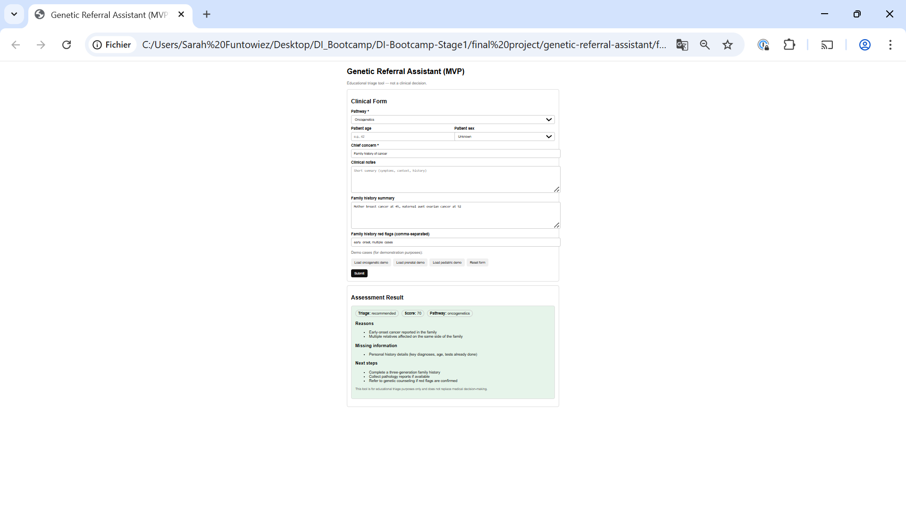
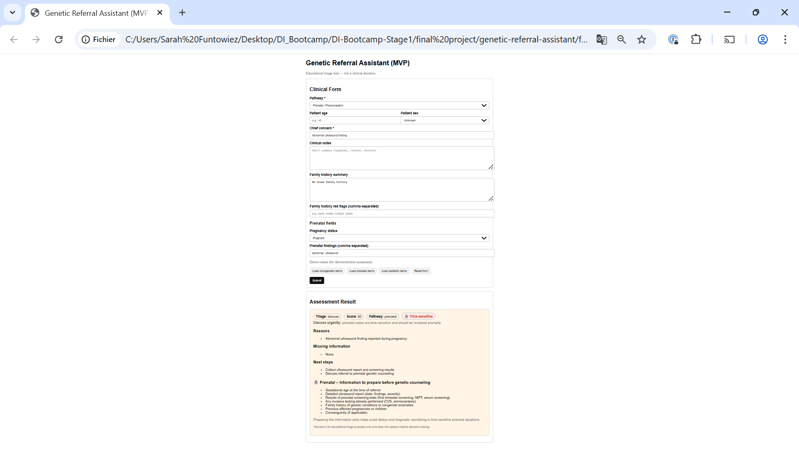
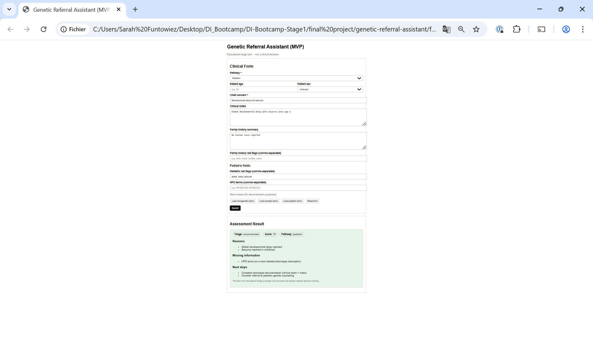

# Genetic Referral Assistant (MVP)

Educational decision-support tool designed to help physicians determine whether a patient should be referred to genetic counseling.

⚠️ This tool is for educational and triage purposes only.  
It does NOT provide medical advice and does NOT replace clinical judgment.

---

## Project Overview

The Genetic Referral Assistant is a lightweight web application that simulates a clinical triage workflow for genetic counseling referrals.

The goal is to help clinicians:
- identify situations where a genetic referral should be prioritized,
- understand why a referral is suggested,
- know which information is missing before referral.

The application focuses on three clinical pathways:
- Oncogenetics – personal or family history of cancer
- Prenatal genetics – pregnancy-related, time-sensitive situations
- Pediatric genetics – children with suspected rare genetic conditions

All data used in this project is synthetic and created for educational purposes only.

---

## Clinical Rationale

Genetic referrals are often complex and delayed due to incomplete or poorly structured clinical information.

This project aims to:
- support early orientation (not diagnosis),
- reduce diagnostic wandering,
- highlight time-sensitive prenatal situations,
- encourage structured data collection before referral.

For prenatal cases, the interface displays a time-sensitive badge, an urgent message, and a dedicated pre-consultation checklist to emphasize the importance of rapid review without replacing human medical decision-making.

---

## User Interface

Clinical Form  

Oncogenetic Case Example  

Prenatal Case – Time-Sensitive Triage  

Pediatric Case Example  

---

## Technical Stack

Frontend:
- HTML
- CSS
- Vanilla JavaScript

Backend:
- Node.js
- Express

Decision Logic:
- Rule-based triage engine (v1)

Data:
- Synthetic clinical cases only

---

## Project Structure

genetic-referral-assistant/
├─ backend/
│  ├─ server.js
│  └─ decisionEngine.js
├─ frontend/
│  ├─ index.html
│  └─ app.js
├─ docs/
│  ├─ api_payload_oncogenetics.json
│  ├─ api_payload_prenatal.json
│  ├─ api_payload_pediatric.json
│  ├─ api_response_example_oncogenetics.json
│  ├─ api_response_example_prenatal.json
│  └─ api_response_example_pediatric.json
├─ assets/
│  ├─ ui_form.png
│  ├─ ui_onco.png
│  ├─ ui_prenatal.png
│  └─ ui_pediatric.png
└─ README.md

---

## How to Run the Project (Windows)

1) Start the backend API

cd backend  
npm install  
node server.js  

The API runs on:  
http://localhost:3001

2) Open the frontend

Open the following file in a browser:  
frontend/index.html

Use the Load demo buttons to explore each clinical pathway.

---

## Demo Features

- Pre-filled demo cases for oncogenetics, prenatal genetics, and pediatric genetics
- Clear triage outputs: recommended, discuss, not prioritized
- Explainable reasons for each decision
- Identification of missing clinical information
- Time-sensitive handling for prenatal cases
- Reset form functionality

---

## Limitations & Scope

- No real patient data
- No diagnosis or medical decision-making
- Rule-based logic only (no machine learning in v1)
- No database or authentication
- Educational use only

---

## Future Improvements

- Integration of clinical guidelines using RAG and LLMs
- Machine learning–based risk scoring
- Pedigree and phenotype visualization
- Secure data storage and authentication
- Exportable referral summaries

---

## Educational Purpose

This project was developed as part of a GenAI & Machine Learning Bootcamp and is intended solely for educational demonstration.

