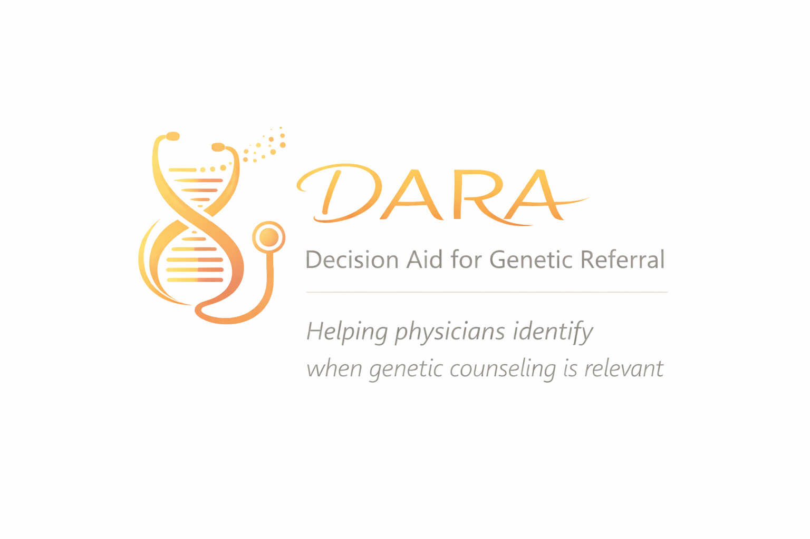
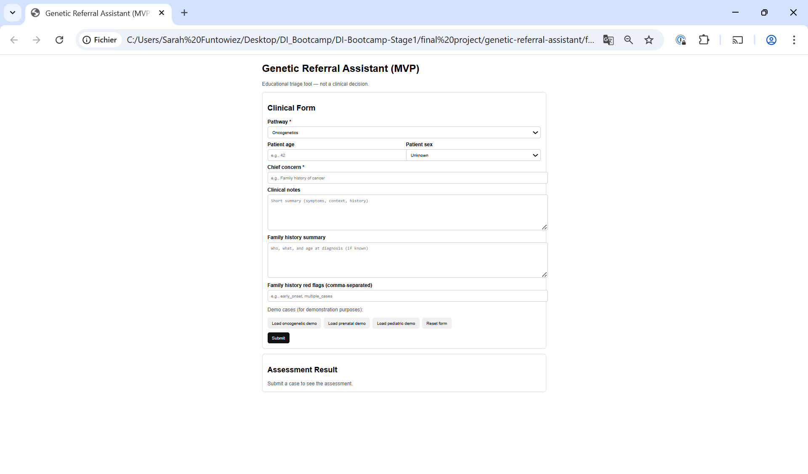
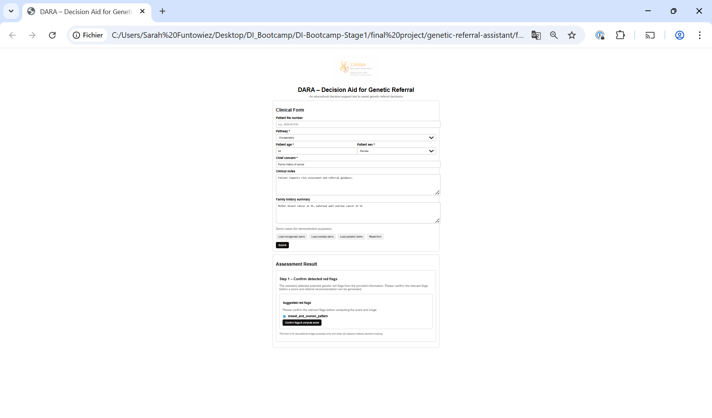
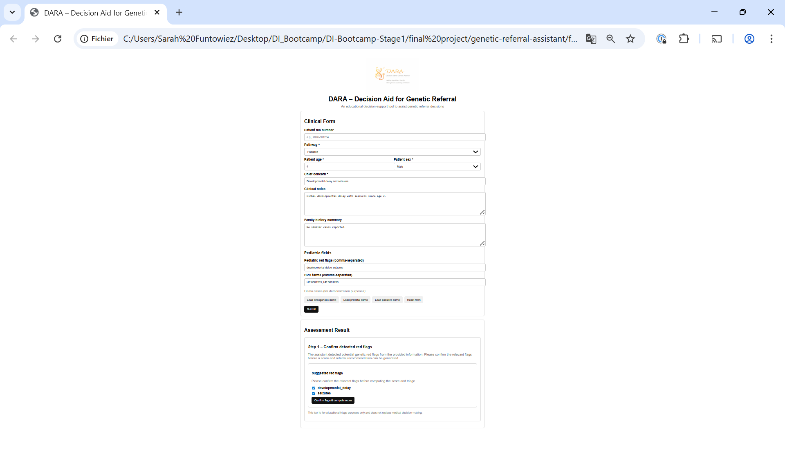
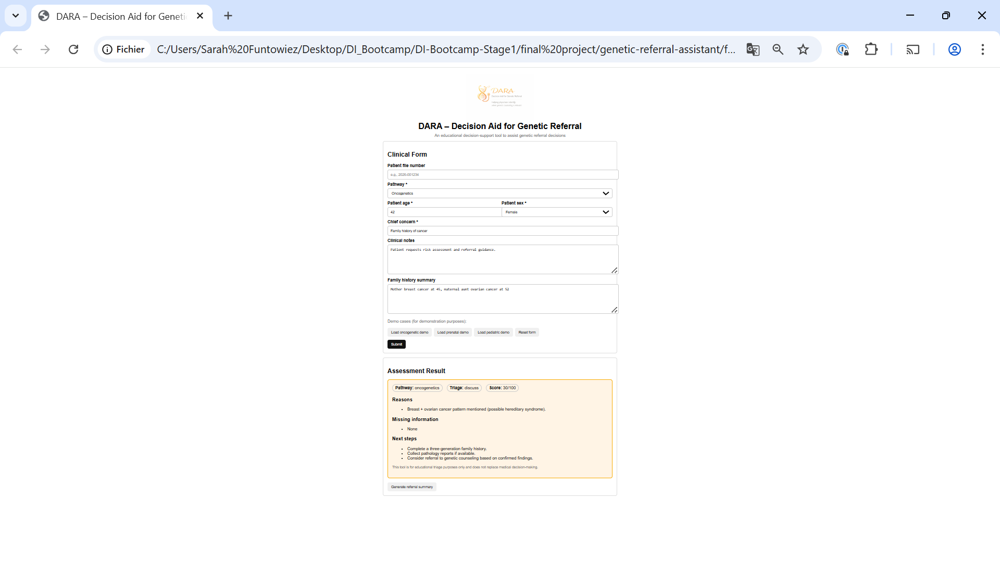
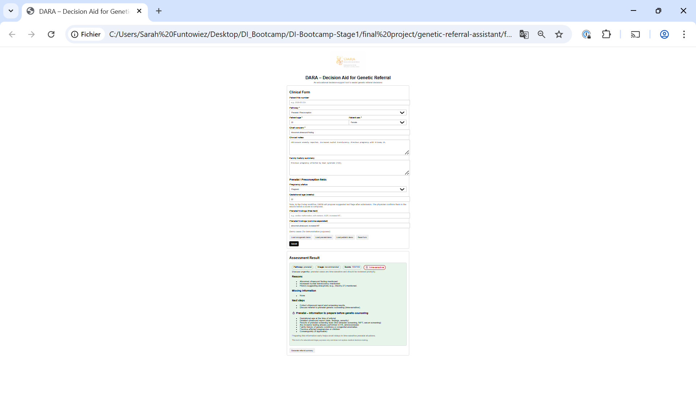
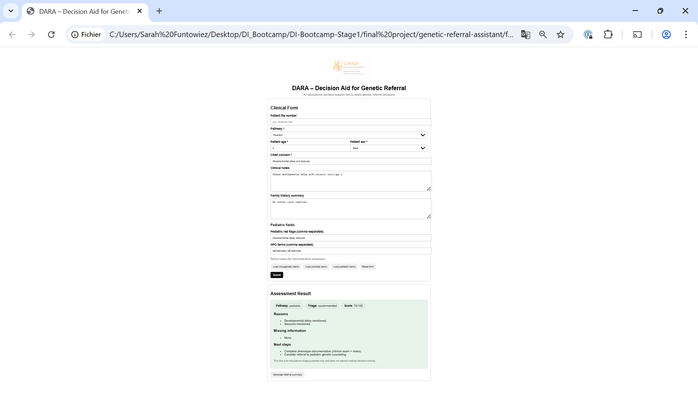

  

# DARA – Decision Aid & Referral Assistant

DARA (Decision Aid & Referral Assistant) is an educational clinical decision-support tool designed to help physicians determine whether a patient should be referred for genetic counseling.

DARA does NOT replace clinical judgment.  
It supports structured reasoning, transparency, and physician-in-the-loop decision-making.

---

## Disclaimer

This tool is for educational and triage purposes only.  
It does not provide medical advice and must not be used as a standalone clinical decision system.  
Final decisions always remain the responsibility of the physician.

---

## Purpose

Genetic referral decisions are complex, time-sensitive, and highly dependent on clinical context.

DARA helps clinicians by:
- Structuring clinical information
- Detecting potential genetic red flags from structured inputs and free text
- Explaining why a referral may be relevant
- Supporting transparent, explainable decision reasoning
- Keeping the physician fully in control of the final decision

---

## Supported Clinical Pathways

DARA currently supports three genetic referral pathways:
- Oncogenetics
- Prenatal / Preconception genetics (time-sensitive)
- Pediatric genetics

Each pathway has adapted rules, signals, and recommendations.

---

## Core Design Principle: Physician-in-the-Loop

DARA follows a strict physician-in-the-loop approach.  
The tool never computes a score or referral recommendation without explicit physician validation.  
All automated detections remain suggestions and require confirmation.

---

## Two-Step Workflow

### Step 0 – Clinical form

The physician completes a structured clinical form adapted to the selected pathway.  
The form includes:
- Patient demographics
- Chief concern
- Free-text clinical notes
- Family history summary
- Pathway-specific fields (prenatal or pediatric)

Screenshots available in `assets/`:
- Empty form: 
- Filled demo forms with suggested red flags
- Filled demo forms with final assessment results

---

### Step 1 – Suggested red flags (confirmation required)

After submission:
- DARA analyzes ALL provided fields, including free text
- Potential genetic red flags are detected automatically
- Suggested red flags are displayed for physician confirmation

At this stage:
- No score is computed
- No triage is assigned
- Physician confirmation is mandatory

Screenshots available in `assets/`:
- Oncogenetics: 
- Prenatal: 
- Pediatric: 

The physician may confirm or uncheck flags, then click:  
“Confirm flags & compute score”

---

### Step 2 – Final assessment result

After confirmation:
- A priority score (0–100) is computed
- A triage recommendation is produced:
  - recommended
  - discuss
  - not_prioritized
- Explicit clinical reasons are listed
- Missing information is highlighted
- Suggested next steps are provided

Suggested red flags are no longer displayed at this stage.

Screenshots available in `assets/`:
- Oncogenetics: 
- Prenatal: 
- Pediatric: 

---

## Prenatal Pathway – Time-Sensitive Design

Prenatal cases are explicitly marked as time-sensitive.  
The interface highlights urgency and encourages early preparation of:
- Gestational age
- Ultrasound reports
- Screening and NIPT results
- Previous affected pregnancies
- Relevant family history

### Prenatal Data Fields – Design Rationale

The prenatal pathway includes three complementary sources of information:

1. Clinical notes (free text)  
   Narrative medical context written by the physician.  
   Captures history, nuance, and clinical reasoning.  
   Used for contextual analysis and GenAI explanation.

2. Prenatal findings (free text, optional)  
   Short, focused description of prenatal findings.  
   Helps detect relevant red flags when notes are long or complex.  
   Acts as a bridge between narrative text and structured data.

3. Prenatal findings (comma-separated, optional)  
   Semi-structured, machine-friendly input.  
   Enables precise and unambiguous detection of red flags.  
   Particularly useful for demos, tests, and reproducibility.

All fields are optional and complementary.  
If provided, structured or semi-structured findings improve red flag detection accuracy, while the full clinical context is always considered.

---

## GenAI (LLM) Explanation Layer – Optional and Safe

DARA includes an optional Generative AI (LLM) component whose role is **strictly limited to explanation**.

All clinical reasoning, scoring, and triage decisions are performed by a **deterministic, rule-based decision engine**.  
The LLM is introduced **after** the decision process and never influences clinical outcomes.

### Core principles

- The LLM **NEVER influences** scoring, triage, or referral decisions  
- The decision engine **always runs first**  
- The LLM **only explains results that have already been computed**  
- If the LLM is unavailable, the system **automatically falls back** to deterministic output  

When the OpenAI API is:
- **Available** → a clear, educational explanation is generated  
- **Rate-limited or unavailable** → a fallback explanatory message is shown  
- **Disabled** → deterministic results are returned without explanation  

This design guarantees reliability, safety, and demo stability at all times.

---

### Why add a GenAI (LLM) layer to a rule-based system?

The core clinical reasoning in DARA is intentionally rule-based, explainable, and deterministic.  
Scores, triage levels, and clinical reasons are precise, transparent, and traceable.

However, structured outputs such as numerical scores or lists of red flags can remain **difficult to interpret**, especially for non-specialist clinicians, trainees, or physicians less familiar with genetic referral criteria.

The GenAI (LLM) component addresses this gap by transforming structured decision outputs into a **concise, human-readable explanation** that:

- Clarifies **why** a referral is (or is not) recommended  
- Makes genetic reasoning accessible to non-geneticist clinicians  
- Improves transparency and user trust  
- Supports education and clinical training  

Importantly:
- The LLM **does not introduce new clinical reasoning**  
- It **does not modify** the decision outcome  
- It **does not replace physician judgment**  

If the LLM is unavailable, DARA continues to function normally using its deterministic logic.

**In summary: the LLM does not make decisions — it explains decisions.**

---

## Technical Architecture

### Frontend
- HTML
- CSS
- Vanilla JavaScript

### Backend
- Node.js
- Express.js
- REST API
- Rule-based decision engine (fully explainable)

### Design Choice: Rule-Based Logic

A rule-based approach was intentionally chosen to ensure:
- Clinical transparency
- Explainability
- Deterministic behavior
- Physician trust and validation

This design avoids black-box behavior and ensures that every suggested red flag, score, and recommendation can be traced back to explicit clinical rules.

Unit tests (Jest) are included to validate the decision engine logic and key edge cases.
 
---

## Requirements

- Node.js  >= 18 (tested v24.12.0)
- npm v11.6.2

## Tested environment

- Frontend tested with Google Chrome (Version 144.0.7559.97) using VS Code Live Server
- Backend tested on Windows (PowerShell)

--- 

## Running the Project Locally

### Backend

cd backend  
npm install  
node server.js  

Backend runs on:  
http://localhost:3001

---

### Frontend

Open the following file in a browser:  
frontend/index.html  

The backend must be running for demos and submissions to work.

---

## Project Structure

DARA-decision-aid-referral-assistant/  
├── backend/  
│   ├── server.js  
│   ├── decisionEngine.js  
│   └── package.json  
├── frontend/  
│   ├── index.html  
│   ├── app.js  
│   └── styles.css  
├── assets/  
│   ├── logo_DARA_info.png  
│   ├── ui_form.png  
│   ├── ui_onco_suggested_red_flag.png  
│   ├── ui_onco_result.png  
│   ├── ui_prenatal_suggested_red_flag.png  
│   ├── ui_prenatal_result.png  
│   ├── ui_pediatric_suggested_red_flag.png  
│   └── ui_pediatric_result.png  
└── README.md

---

## Demo & Screenshots

All demo screenshots illustrating:
- Empty forms
- Suggested red flags (step 1)
- Final assessment results (step 2)

are available in the `assets/` folder for all three pathways.

---

## Key Takeaways

- Physician remains in control at all times
- No automatic referral decisions
- Transparent and explainable logic
- Workflow mirrors real clinical reasoning
- GenAI is used only for explanation, never for decision-making

---

## Scope and Ethics

- Educational tool only
- No diagnosis
- No real patient data
- No database or data persistence
- Clear disclaimer included in the interface and outputs

---

## Possible Future Extensions

### Data & Persistence
- Optional database (e.g., SQLite or PostgreSQL) to store cases, results, and audit trails
- Case history and longitudinal follow-up across visits

### Advanced NLP & AI
- Semantic embeddings for richer free-text understanding
- Machine learning models trained on validated clinical datasets (if available)
- Improved signal extraction from unstructured clinical narratives

### Reliability & Production Hardening
- Add LLM timeout, retry policy, and circuit breaker to improve robustness in production environments

### Security & Governance
- User authentication and role-based access
- Audit trail for clinical accountability and traceability

### Product & UX
- Multi-language user interface
- Improved clinician-facing summaries and exports

---

## Future Extensions in a Real Clinical Context (Out of Scope for This Project)

The current version of DARA intentionally focuses on structured clinical data and explainable rule-based reasoning.

The following extensions are clinically relevant but were deliberately excluded from this project to preserve transparency, safety, and physician control.

### 1. Analysis of Medical Documents (PDF)

In real clinical practice, referral decisions rely on multiple documents:
- Laboratory reports
- Pathology reports
- Imaging summaries
- Prenatal screening or NIPT reports

A future version could allow secure upload of PDF documents, which would be:
- Parsed and converted to text
- Analyzed to extract relevant clinical signals
- Used as additional contextual input during Step 1

This was excluded due to:
- Variability and quality of medical PDFs
- OCR uncertainty
- Need for strict human validation

### 2. Advanced Free-Text Analysis and NLP

Future versions could integrate:
- Semantic embeddings
- Similarity-based pattern detection
- Machine learning models trained on validated datasets

These approaches were not implemented to preserve:
- Deterministic behavior
- Full explainability
- Ease of clinical validation

### 3. Medical Image Analysis

Analysis of medical images (ultrasound, MRI, radiology scans) could enrich genetic referral assessment.

However, image-based analysis:
- Requires large validated datasets
- Raises regulatory and ethical challenges
- Goes beyond the scope of an educational tool

### 4. Assisted HPO Term Suggestion for Pediatric Genetics

A future pediatric module could:
- Suggest relevant HPO terms from free-text descriptions
- Present them as selectable options
- Require physician validation before use

This would reduce cognitive burden and improve phenotype standardization, but was excluded to avoid overcomplexity.

---

## Author

Developed as a Final Project for the GenAI & Machine Learning Bootcamp

---

## License
This project is licensed under the MIT License.  
See the `LICENSE` file for details.
